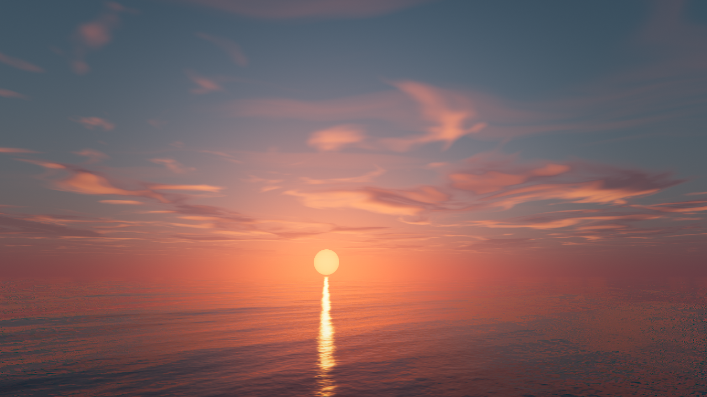

# Cinematic Sunset Ocean Shader

A single-pass, fully procedural WebGL2 fragment shader that renders a cinematic
sunset over a calm open ocean: physically-inspired Rayleigh / Mie / ozone
atmospheric scattering, an HDR sun disc with analytic glare, two layers of
domain-warped procedural clouds, a raymarched Gerstner-wave ocean (Fresnel sky
reflection, microfacet sun glints, absorption and subsurface scattering — all
lit by the same atmospheric model), and in-shader filmic post-processing (ACES
tone mapping, bloom approximation, vignette, subtle chromatic aberration).

Click and drag to orbit the camera — motion is spring-damped with inertia,
pitch is clamped, and the horizon always stays level.

No textures, no lookup tables, no external assets — every pixel is computed
analytically in `src/shaders/sunset.frag.glsl`.



## Run

```bash
npm install
npm run dev
```

Then open the printed local URL. The animation is intentionally almost
imperceptible: clouds evolve in place through a time-varying noise dimension
and the sun drifts over several minutes.

## Structure

- `src/main.ts` — WebGL2 harness (fullscreen triangle, uniforms) plus the
  damped orbit-camera controller
- `src/shaders/fullscreen.vert.glsl` — vertex-buffer-free fullscreen triangle
- `src/shaders/sunset.frag.glsl` — the entire sky + ocean simulation,
  extensively commented
- `scripts/screenshot.mjs` — dev helper: captures a frame with headless system
  Chrome, optionally after a simulated camera drag
  (`node scripts/screenshot.mjs [url] [outfile] [settleMs] [dragX,dragY]`,
  requires `npm i --no-save puppeteer-core`)
